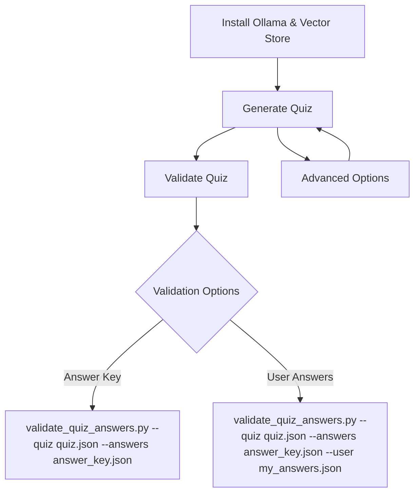

# Quiz Generation Workflow

## Flow Diagram & Summary

This workflow guides you through setting up your local AI quiz system, generating quizzes, and validating answers. The process is fully offline-first, using Ollama and a local vector database (Chroma) built from PDFs or other supported sources. OpenAI is an optional provider. All quiz context comes from the vector database; markdown files are no longer used for quiz generation.



---

## 1. Install Ollama & Build the Vector Store

The quiz pipeline is built around an **offline PDF bundle**. The `vector_store_build.py` script downloads the latest PDF bundle from the GitHub releases page, extracts the PDF files, derives headings from the first meaningful line of each document, and stores the content in a Chroma vector store for retrieval. You only need to run this step when you first set up the system or when new content is added.

**Ollama Installation**
```bash
brew install ollama
ollama pull mistral
```

**Check Ollama Status**
```bash
./scripts/bin/run_venv.sh scripts/rag/check_ollama.py check
```

**Start/Stop Ollama Service**
```bash
./scripts/bin/run_venv.sh scripts/rag/check_ollama.py start
./scripts/bin/run_venv.sh scripts/rag/check_ollama.py stop
```

**Vector Store Build (Local Embeddings)**

To build the vector store using local embeddings from PDFs or other sources, run:

```bash
./scripts/bin/run_venv.sh scripts/rag/vector_store_build.py --local --force
```

This downloads the `pdfs-bundle.tar.gz` release asset, extracts the PDFs, processes them into chunks and writes the resulting Chroma database into the `.chroma` directory.  Use `--force` to rebuild even if a store already exists.

**Vector Store Build (OpenAI Embeddings)**

If you prefer to use OpenAI embeddings instead of local models, set an API key and omit the `--local` flag:

```bash
OPENAI_API_KEY=sk-... ./scripts/bin/run_venv.sh scripts/rag/vector_store_build.py --force
```

---

## 2. Generate the Quiz

After building the vector store, you can generate quiz questions using the `master.py prepare` command.  The prepare step automatically checks the vector store, builds it if needed (when `--auto-build` is supplied), and invokes `generate_quiz.py` with the appropriate flags.

**Primary (Offline, Ollama)**
```bash
./scripts/bin/run_venv.sh scripts/quiz/master.py --ollama --ollama-model mistral \
  --count 5 \
  --quiz quiz.json \
  --answers answer_key.json \
  --rag-persist .chroma \
  --rag-local \
  --rag-k 3 \
  --fresh
```

This command generates 5 questions using the Mistral model via Ollama.  The `--fresh` flag reduces repetition by slightly raising the sampling temperature.  The `--auto-build` flag triggers a vector store rebuild if the store is missing.

**Experimental (OpenAI)**
```bash
./scripts/bin/run_venv.sh scripts/quiz/master.py --ai --model gpt-4o-mini \
  --count 12 \
  --quiz quiz.json \
  --answers answer_key.json \
  --rag-persist .chroma \
  --rag-k 4 \ 
  --rag-local \
  --fresh
```


**Advanced Options**

- Change model: `--ollama-model <name>` (only for Ollama)
- Skip text export: `--no-text` (do not write `quiz.txt`)
- Improve novelty: `--fresh` (increase temperature and avoid repeating recent questions)
- Filter by tags or H1: `--restrict-sources`, `--include-tags`, `--include-h1` (see Filtering section below)

---

## 3. Validate the Quiz

After generating the quiz, you can validate the answer key or check your own answers.

**Interactive Validation with Answer Key**
```bash
./scripts/bin/run_venv.sh scripts/quiz/validate_quiz_answers.py --quiz quiz.json --answers answer_key.json
```
This will prompt you for each question and provide immediate feedback.

**Validate with User Answers**
```bash
./scripts/bin/run_venv.sh scripts/quiz/validate_quiz_answers.py --quiz quiz.json --answers answer_key.json --user my_answers.json
```

**Manual Marking Workflow**
1. Export plain text: `./scripts/bin/run_venv.sh scripts/quiz/export_quiz_text.py`
2. Mark answers in `quiz.txt`
3. Parse answers: `./scripts/bin/run_venv.sh scripts/quiz/master.py parse --in quiz.txt --out my_answers.json --force`
4. Validate as above.

---

## Files Produced

- `quiz.json` – list of question objects (no answers)
- `answer_key.json` – mapping question id -> `{ answer, explanation }`
- `quiz.txt` – markable plain text template (optional, created by prepare script unless `--no-text`)

## Providers & Status

| Provider | Flag | Max Questions | Status | Notes |
|----------|------|---------------|--------|-------|
| OpenAI   | `--ai`     | 20 | Experimental | Requires `OPENAI_API_KEY`; less exercised in daily flow |
| Ollama   | `--ollama` | 5 | Primary | Offline / fast iteration / zero API cost; uses only vector database context |
| OpenAI   | `--ai`     | 20 | Experimental | Requires `OPENAI_API_KEY`; uses only vector database context |
| Template | `--template` | Deprecated | Legacy | Not recommended; does not use current workflow |

> **Accuracy Note (Ollama):** Local models may occasionally produce mismatches (e.g. the answer letter not conceptually matching the best option, weak explanations, or subtly duplicated stems). Validate logically.  If a question looks off: (1) re‑run with `--fresh`, (2) adjust retrieval filters, or (3) manually correct.  The validator checks structure, not semantic truth.  OpenAI path can yield different style but is optional/experimental.

## Offline‑First Philosophy

The system prioritizes *repeatable, air‑gapped study*.  Core guarantees:

1. Works with a **local PDF bundle** converted into a Chroma vector store plus Ollama and HuggingFace embeddings.
2. Never requires an internet call unless you opt into OpenAI.
3. Vector store auto‑build (`--auto-build`) keeps friction low.
4. All quiz context comes from the vector database; template mode is deprecated.

## Ollama Setup & Validation

> Install: https://ollama.com
```bash
ollama pull mistral
./scripts/bin/run_venv.sh scripts/rag/check_ollama.py check
```
> Manage via tasks (Install / Start / Stop / Check) or CLI (`brew services start ollama`).

---

## Customizing

- **Change models:** Use `--ollama-model llama3` or `--model gpt-4o-mini` to experiment with different LLMs.
- **Skip text export:** Add `--no-text` to `master.py prepare` to avoid writing a `quiz.txt` file.
- **Improve novelty:** Add `--fresh` to reduce repetition (stores normalized prior questions in `.quiz_history.json`; increases temperature slightly and retries once if overlap detected).
- **Disable randomness of theme selection:** Add `--no-random-component` when directly invoking `generate_quiz.py` to avoid randomizing RAG queries.  The master script uses default random selection automatically.
- **Deterministic generation:** Template mode is deprecated. Use RAG-based filtering flags (`--restrict-sources`, `--include-tags`, `--include-h1`) for focused quiz generation.

---

## Retrieval‑Augmented Generation (Always On)

The quiz pipeline now automatically retrieves context from a Chroma vector store before LLM prompting. All quiz context comes from the vector database. Markdown files are not used for quiz generation.

### Preflight Validation (`master.py prepare`)

Before generating questions the master script will:
1. Check vector store health (load & test a similarity search).
2. Auto‑build the store if missing and `--auto-build` is provided.
3. Validate provider connectivity:
   - OpenAI: API key presence + simple model list probe.
   - Ollama: binary present, daemon reachable, model pulled (auto‑pulls if absent).

If any required service is down, the run aborts early (no partial files created).

### Vector Store Build (Manual / CI)

Use the build script manually when running in CI or if you want more control over chunking.  For example:

```bash
./scripts/bin/run_venv.sh scripts/rag/vector_store_build.py --local --force
```

Common tuning flags: `--persist .chroma` (default), `--chunk-size 900`, `--chunk-overlap 120`.  The `--glob` and `--exclude` flags used in the older markdown workflow are not needed because the PDF bundle is automatically downloaded and processed.

### New Master Flags

| Flag | Purpose |
|------|---------|
| `--persist DIR` | Vector store directory (default .chroma) |
| `--auto-build` | Build store if missing before generation |
| `--local-embeddings` | Expect local HF embeddings (must match how store was built) |
| `--rag-k N` | Top‑k chunks per retrieval query (passed through) |
| `--rag-queries q1 q2 ...` | Override default internal retrieval queries |

### Retrieval Behavior

Queries: A default curated list (caching, load balancing, queues, replication, gateway, etc.) is truncated based on requested question count.  Each query retrieves `--rag-k` chunks.  Duplicates are de‑duplicated via raw snippet text hashing.  All unique chunks are concatenated into one synthetic context document fed to the model provider.

### Citation Markers (Grounding)

When RAG runs, each retrieved chunk is assigned a citation label like `C1`, `C2`, ...

Structure of the generated synthetic context (`RAG_CONTEXT.md`):
1. A header directory listing: `C#: <source path> :: <section heading>`
2. Separator line `---`
3. Bodies: Each block starts with `[C#] (source: <path>, heading: <heading>)` followed by the snippet text.

Model Prompting Expectation:

- The LLM is instructed (inline) to ground every question in one or more cited sections and avoid unsupported invention.
- You can manually inspect which sections influenced a quiz by opening `RAG_CONTEXT.md` (if you run `generate_quiz.py` directly) or by re‑running with the same parameters.

### Source & Tag / H1 Filtering (Direct `generate_quiz.py`)

You can constrain retrieval without rebuilding the store using the following flags.  These operate on the metadata stored in the vector store:

| Flag | Purpose | Match Logic |
|------|---------|-------------|
| `--restrict-sources PAT...` | Only include chunks whose `source` path matches ANY provided pattern | Substring or glob (`*`, `?`) on relative PDF path |
| `--include-tags TAG...` | Require at least one of these tag tokens | Tags originate from directory names, file stem tokens, and the H1 slug |
| `--include-h1 H1...` | Require the first H1 slug match | Slugified (non‑alphanumerics → `-`), partial contains allowed |

**Examples:**

```bash
# Restrict retrieval to a specific PDF or directory
./scripts/bin/run_venv.sh scripts/quiz/generate_quiz.py --ollama --rag-local --restrict-sources pdfs/rate-limiter-design.pdf --count 5

# Chunks tagged caching OR redis (tags come from directory names and H1 slugs)
./scripts/bin/run_venv.sh scripts/quiz/generate_quiz.py --ollama --rag-local --include-tags caching redis --count 5

# H1 slug contains rate-limiting (derived from the first text line in each PDF)
./scripts/bin/run_venv.sh scripts/quiz/generate_quiz.py --ollama --rag-local --include-h1 rate-limiting --count 10

# Combine all filters
./scripts/bin/run_venv.sh scripts/quiz/generate_quiz.py --ollama --rag-local \
  --restrict-sources pdfs \
  --include-tags caching consistency \
  --include-h1 rate-limiting --count 10
```

Notes:

- Filters are also available via `master.py prepare` (pass them after provider flags).  Previously they were only for direct `generate_quiz.py` calls.
- Tags & H1 slugs are lowercase internally; supply lowercase values.
- The filters combine as OR within a category and AND across categories.
- Exclusion flags (`--exclude-tags`, etc.) are not implemented yet.

Master pass‑through example:

```bash
./scripts/bin/run_venv.sh scripts/quiz/master.py prepare --ollama \
  --count 5 --local-embeddings --auto-build \
  --restrict-sources pdfs \
  --include-tags caching consistency \
  --include-h1 rate-limiting
```

### Recommended Settings

- Keep `--rag-k` between 3–5.
- Rebuild the store (`--auto-build` or manual) after adding new PDFs to the release bundle.
- Prefer local embeddings for consistent offline workflow (`--local-embeddings`).
- Use OpenAI embeddings only if you explicitly need broader semantic recall (experimental path).

### Disabling RAG (Debug Only)

If you need to benchmark raw behavior or inspect model output without context, call `generate_quiz.py` directly with `--no-rag` (the master script always uses RAG).

### Maintenance Tips

- Delete & rebuild (`--force`) after large document reorganizations or when a new PDF bundle is released.
- Monitor store size; extremely large stores may slow retrieval—consider pruning outdated notes.

## Troubleshooting

| Symptom | Cause | Resolution |
|---------|-------|------------|
| Vector store missing | Not built yet | Add `--auto-build` or run build script manually |
| Vector store health check failed | Embedding mismatch / corrupt dir | Rebuild with matching flags (`--local` vs OpenAI) |
| Ollama request error | Daemon not running | `./scripts/bin/run_venv.sh scripts/rag/check_ollama.py start` or launch app |
| 0 questions returned | Model output malformed | Re-run; ensure model supports instruction following |
| Validation failed: count mismatch | Model produced fewer items | Re-run; sometimes temperature / truncation issues |
| OPENAI_API_KEY error | Env var missing | Only needed for experimental OpenAI path; `export OPENAI_API_KEY=sk-...` |
| Question seems wrong / answer dubious (Ollama) | Model hallucination | Re-run with `--fresh`; switch provider; manual edit |

## Example Snippet

```json
[
  {
    "id": "Q1",
    "question": "Which component handles rate limiting?",
    "options": ["API Gateway", "Object Store", "CDN Edge", "Log Indexer"],
    "topic": "Rate Limiter System Design",
    "difficulty": "medium"
  }
]
```

#### *Placeholder Heading (Fill Me)*
> Return to main README: [README.md](./README.md)