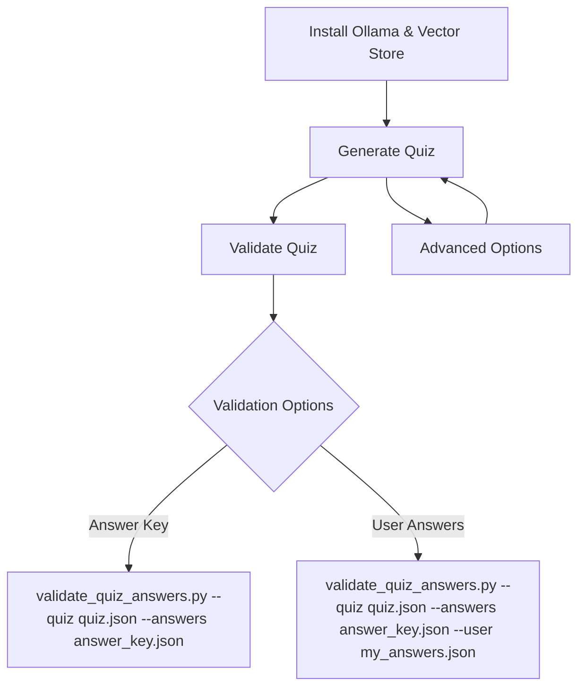

# Quiz Generation Workflow

## Flow Diagram & Summary

This workflow guides you through setting up your local AI quiz system, generating quizzes, and validating answers. The process is fully offline-first, using Ollama and a local vector database (Chroma) built from PDFs or other supported sources. OpenAI is an optional provider. All quiz context comes from the vector database; markdown files are no longer used for quiz generation.



---

## 1. Install Ollama & Build the Vector Store

The quiz pipeline is built around an **offline PDF bundle**. The `vector_store_build.py` script downloads the latest PDF bundle from the GitHub releases page, extracts the PDF files, derives headings from the first meaningful line of each document, and stores the content in a Chroma vector store for retrieval. You only need to run this step when you first set up the system or when new content is added.

**Ollama Installation**
```bash
brew install ollama
ollama pull mistral
```

**Check Ollama Status**
```bash
./scripts/bin/run_venv.sh scripts/rag/check_ollama.py check
```

**Start/Stop Ollama Service**
```bash
./scripts/bin/run_venv.sh scripts/rag/check_ollama.py start
./scripts/bin/run_venv.sh scripts/rag/check_ollama.py stop
```

**Vector Store Build (Local Embeddings)**
```bash
./master.py prepare
```
This reads all settings from `quiz.params`, runs the optional pre-build step if `[build] enabled=true`, downloads the `pdfs-bundle.tar.gz` release asset, extracts the PDFs, processes them into chunks, and writes the Chroma database into the directory specified by `persist` in `quiz.params` (e.g., `.chroma`). Rebuild behavior (e.g., force, embedding mode, chunk sizes) is controlled entirely by the `[build]` section.

**Vector Store Build (OpenAI Embeddings)**

Set `openai=true` (and `local=false`) in the `[build]` section of `quiz.params`, export `OPENAI_API_KEY`, then run:

```bash
./master.py prepare
```

All embedding and build options come from `quiz.params`.

---

## 2. Generate the Quiz

After building the vector store, you can generate quiz questions using the `master.py prepare` command.  The prepare step automatically checks the vector store, builds it if needed (when `[build] enabled=true` is supplied), and invokes `generate_quiz.py` with the appropriate flags.

**Primary (Offline, Ollama)**
```bash
./master.py prepare
```
This generates questions using provider and model settings from `quiz.params` (e.g., `provider=ollama`, `model=mistral`). Question count, output file names, retrieval parameters, and freshness are all defined in `[prepare]`.

**Experimental (OpenAI)**

Set `provider=ai` and `model=<openai-model>` in `[prepare]` of `quiz.params`, export `OPENAI_API_KEY`, then run:

```bash
./master.py prepare
```

**Advanced Options**

- Change model: set `provider` and `model` in `[prepare]` (e.g., `provider=ollama`, `model=mistral`)
- Improve novelty: set `fresh=true` in `[prepare]`
- Retrieval depth: set `rag_k` in `[prepare]`
- Filtering: set `include_tags`, `include_h1`, and `restrict_sources` in `[prepare.rag]`

---

## 3. Validate the Quiz

After generating the quiz, you can validate the answer key or check your own answers.

**Interactive Validation with Answer Key**
```bash
./master.py validate
```
This will prompt you for each question and provide immediate feedback.

**Validate with User Answers**
```bash
./master.py validate
```

**Manual Marking Workflow**
1. Export plain text: `./master.py export`
2. Mark answers in `quiz.txt`
3. Parse answers: `./master.py parse`
4. Validate as above.

---

## Files Produced

- `quiz.json` – list of question objects (no answers)
- `answer_key.json` – mapping question id -> `{ answer, explanation }`
- `quiz.txt` – markable plain text template (optional, created by prepare script unless `--no-text`)

## Providers & Status

| Provider | Config Source | Max Questions | Status | Notes |
|----------|----------------|---------------|--------|-------|
| OpenAI   | `quiz.params`  | 20            | Experimental | Requires `OPENAI_API_KEY`; configured via `[prepare]` |
| Ollama   | `quiz.params`  | 5             | Primary      | Offline / fast iteration / zero API cost; configured via `[prepare]` |

> **Accuracy Note (Ollama):** Local models may occasionally produce mismatches (e.g. the answer letter not conceptually matching the best option, weak explanations, or subtly duplicated stems). Validate logically.  If a question looks off: (1) re‑run with `fresh=true` in params; (2) adjust retrieval filters; or (3) manually correct.  The validator checks structure, not semantic truth.  OpenAI path can yield different style but is optional/experimental.

## Offline‑First Philosophy

The system prioritizes *repeatable, air‑gapped study*.  Core guarantees:

1. Works with a **local PDF bundle** converted into a Chroma vector store plus Ollama and HuggingFace embeddings.
2. Never requires an internet call unless you opt into OpenAI.
3. Vector store auto‑build (`[build] enabled=true`) keeps friction low.
4. All quiz context comes from the vector database; template mode is deprecated.

## Ollama Setup & Validation

> Install: https://ollama.com
```bash
ollama pull mistral
./scripts/bin/run_venv.sh scripts/rag/check_ollama.py check
```
> Manage via tasks (Install / Start / Stop / Check) or CLI (`brew services start ollama`).

---

## Customizing

- **Change models:** Edit `[prepare] provider` and `model` (e.g., `provider=ollama`, `model=mistral`).
- **Improve novelty:** Set `fresh=true` in `[prepare]`.
- **Deterministic retrieval focus:** Edit `[prepare.rag]` values (`include_tags`, `include_h1`, `restrict_sources`).

---

## Retrieval‑Augmented Generation (Always On)

The quiz pipeline now automatically retrieves context from a Chroma vector store before LLM prompting. All quiz context comes from the vector database. Markdown files are not used for quiz generation.

### Preflight Validation (`master.py prepare`)

Before generating questions the master script will:
1. Build the vector store if `[build] enabled=true`.
2. Validate provider connectivity per `[prepare]` (OpenAI key or Ollama daemon).
3. Proceed with generation using retrieval parameters in `[prepare]` and `[prepare.rag]`.

### Vector Store Build (Manual / CI)

Prefer `./master.py prepare` which drives the pre-build from `quiz.params`. For CI or manual control, call the builder directly (all flags required):

```bash
./scripts/bin/run_venv.sh scripts/rag/vector_store_build.py \
  --persist ./.chroma \
  --chunk-size 800 \
  --chunk-overlap 120 \
  --local \  # or --openai
  --model sentence-transformers/all-MiniLM-L6-v2 \
  --bundle-url https://github.com/brandon-benge/InterviewPrep/releases/download/latest/pdfs-bundle.tar.gz \
  --force
```

### New Master Flags

### quiz.params (minimal skeleton)

```ini
[build]
enabled=true
persist=.chroma
chunk_size=800
chunk_overlap=120
model=sentence-transformers/all-MiniLM-L6-v2
bundle_url=https://github.com/brandon-benge/InterviewPrep/releases/download/latest/pdfs-bundle.tar.gz
local=true
openai=false
force=true

[prepare]
provider=ollama
model=mistral
count=5
quiz=quiz.json
answers=answer_key.json
rag_persist=.chroma
rag_k=3
fresh=true
rag_local=true
rag_openai=false

[prepare.rag]
include_tags=team prioritization
include_h1=
restrict_sources=
```

### Source & Tag / H1 Filtering (Direct `generate_quiz.py`)

> Set filters in `[prepare.rag]` inside `quiz.params` (e.g., `include_tags=caching consistency`, `include_h1=rate-limiting`, `restrict_sources=pdfs`). Then run `./master.py prepare`.

Notes:

- Filters are also available via `master.py prepare` (pass them after provider flags).  Previously they were only for direct `generate_quiz.py` calls.
- Tags & H1 slugs are lowercase internally; supply lowercase values.
- The filters combine as OR within a category and AND across categories.
- Exclusion flags (`--exclude-tags`, etc.) are not implemented yet.

### Recommended Settings

- Keep `rag_k` between 3–5.
- Rebuild the store (`[build] enabled=true` or manual) after adding new PDFs to the release bundle.
- Prefer local embeddings for consistent offline workflow (`local=true`).
- Use OpenAI embeddings only if you explicitly need broader semantic recall (experimental path).

### Disabling RAG (Debug Only)

If you need to benchmark raw behavior or inspect model output without context, call `generate_quiz.py` directly with `--no-rag` (the master script always uses RAG).

### Maintenance Tips

- Delete & rebuild (`force=true`) after large document reorganizations or when a new PDF bundle is released.
- Monitor store size; extremely large stores may slow retrieval—consider pruning outdated notes.

## Troubleshooting

| Symptom | Cause | Resolution |
|---------|-------|------------|
| Vector store missing | Not built yet | Add `[build] enabled=true` or run build script manually |
| Vector store health check failed | Embedding mismatch / corrupt dir | Rebuild with matching flags (`local=true` vs OpenAI) |
| Ollama request error | Daemon not running | `./scripts/bin/run_venv.sh scripts/rag/check_ollama.py start` or launch app |
| 0 questions returned | Model output malformed | Re-run; ensure model supports instruction following |
| Validation failed: count mismatch | Model produced fewer items | Re-run; sometimes temperature / truncation issues |
| OPENAI_API_KEY error | Env var missing | Only needed for experimental OpenAI path; `export OPENAI_API_KEY=sk-...` |
| Question seems wrong / answer dubious (Ollama) | Model hallucination | Re-run with `fresh=true` in params; switch provider; manual edit |

## Example Snippet

```json
[
  {
    "id": "Q1",
    "question": "Which component handles rate limiting?",
    "options": ["API Gateway", "Object Store", "CDN Edge", "Log Indexer"],
    "topic": "Rate Limiter System Design",
    "difficulty": "medium"
  }
]
```

#### *Placeholder Heading (Fill Me)*
> Return to main README: [README.md](./README.md)