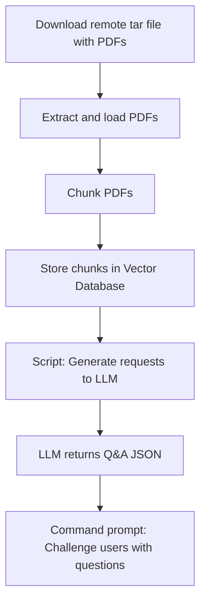

# RAG-Workflow

RAG-Workflow is a pipeline for automated quiz generation from remote PDF documents. It downloads a tar archive of PDFs, processes and chunks the documents, stores them in a vector database (Chroma), and uses large language models (OpenAI, Ollama) to generate question-answer pairs. The resulting quizzes are presented to users via a command-line interface for interactive learning and assessment.

## Workflow Overview

### Steps Explained

1. **Download remote tar file with PDFs**: Retrieve a compressed archive containing multiple PDF documents from a remote source.
2. **Extract and load PDFs**: Unpack the tar file and prepare the PDFs for processing.
3. **Chunk PDFs**: Split the PDFs into manageable text chunks for embedding and retrieval.
4. **Store chunks in Vector Database (Chroma)**: Embed the chunks and store them in a vector database for efficient similarity search.
5. **Script: Generate requests to LLM (e.g., OpenAI and Ollama)**: Use a script to send the chunks as prompts to a Large Language Model (LLM) to generate questions and answers.
6. **LLM returns Q&A JSON**: Collect the responses from the LLM and save them as a JSON file containing questions and answers.
7. **Command prompt: Challenge users with questions**: Use a command-line interface to present questions to users and evaluate their answers.

For more details on quiz generation, see the [QUIZ_GENERATION.md](QUIZ_GENERATION.md) file.

